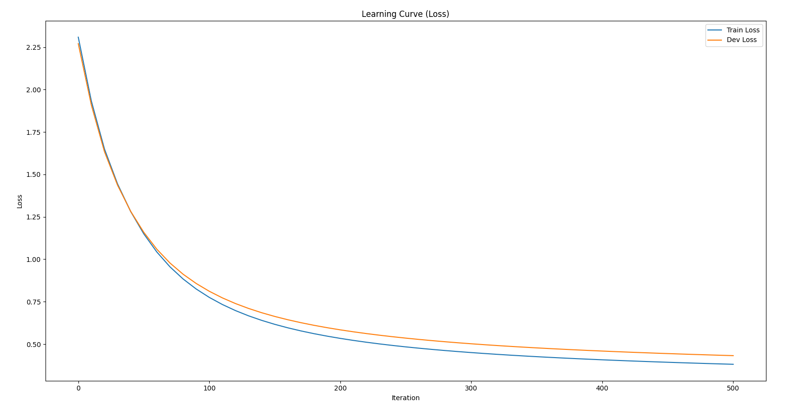

# Dense Neural Network from Scratch (NumPy)

This project implements a fully connected neural network from first principles using NumPy.

## Features
- Manual forward propagation
- Backpropagation with gradient computation
- ReLU activation
- Softmax + Cross-Entropy loss
- L2 regularization
- Hyperparameter tuning (hidden size, lambda)
- Training & validation accuracy tracking
- Learning curve visualization

## Dataset
- MNIST handwritten digit dataset (28x28 grayscale images)

## How to Run

```bash
pip install numpy pandas matplotlib
python MNISTtrainingNN.py

## Results

### Training Accuracy Curve


### Training Loss Curve


### Example


## Performance

- Training Accuracy: 89.3%
- Validation Accuracy: 86.8%
- Test Accuracy: 89.9%
