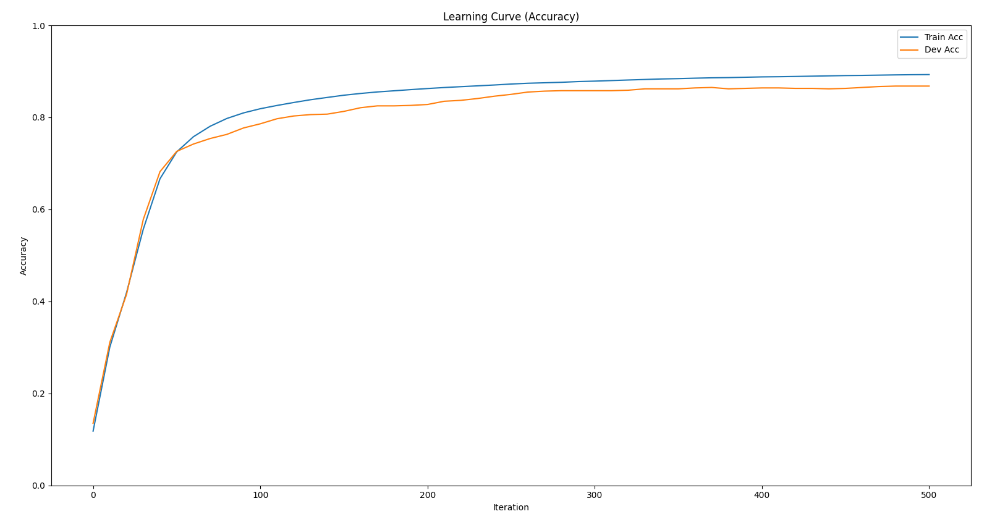
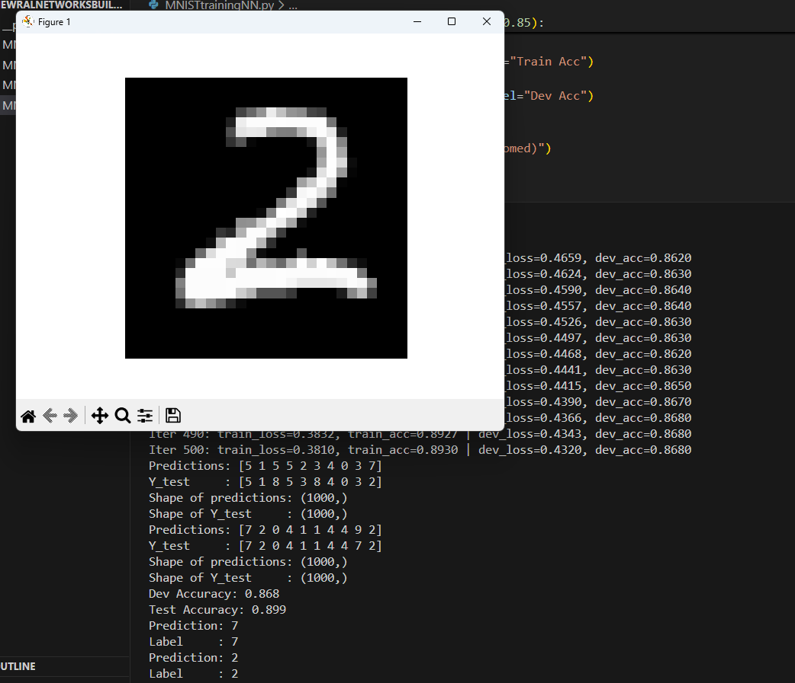
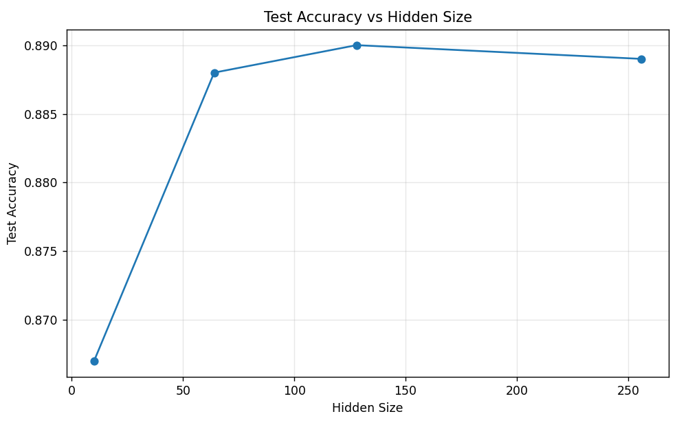
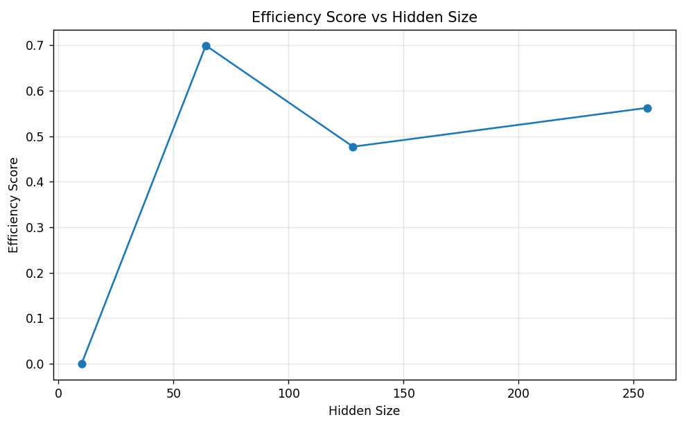
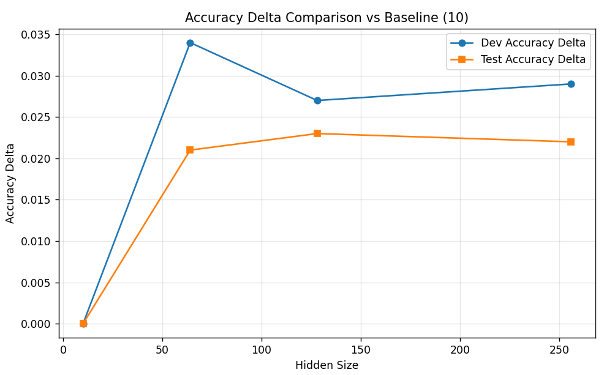
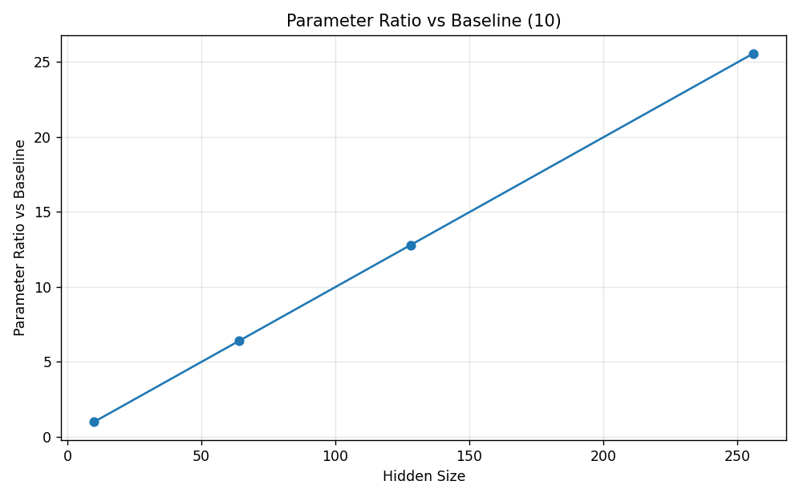
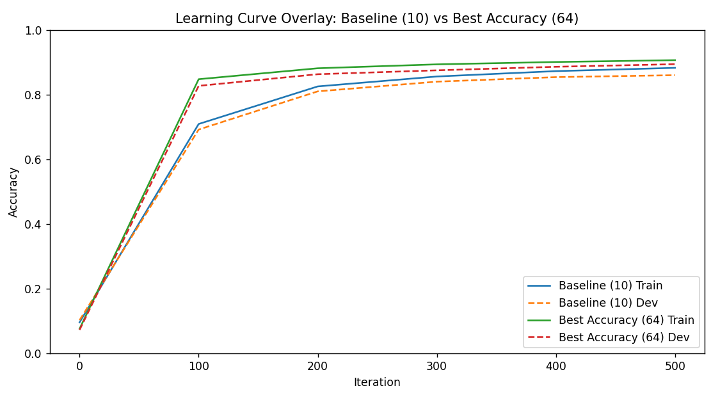

# MNIST Dense Neural Network from Scratch (NumPy)

This project implements a **fully connected neural network from first principles using NumPy** for handwritten digit classification on the **MNIST** dataset.

Instead of relying on deep learning frameworks such as PyTorch or TensorFlow, the model is built manually in order to understand the mathematical and computational foundations of neural networks, including:

- forward propagation
- activation functions
- softmax output probabilities
- cross-entropy loss
- L2 regularization
- backpropagation
- gradient descent optimization
- architecture comparison and model-selection tradeoffs

Beyond a single baseline model, the project also performs a **hidden-layer size study** to compare multiple architectures and analyze the tradeoff between:

- predictive performance
- computational runtime
- model complexity
- efficiency

This turns the project from a simple classifier into a small **model-selection and efficiency analysis study**, which aligns closely with practical machine learning and optimization thinking.

---

## Table of Contents

1. [Project Objective](#project-objective)
2. [Dataset](#dataset)
3. [Network Architecture](#network-architecture)
4. [Mathematical Foundations](#mathematical-foundations)
   - [Notation](#notation)
   - [Forward Propagation](#forward-propagation)
   - [Loss Function](#loss-function)
   - [L2 Regularization](#l2-regularization)
   - [Total Objective Function](#total-objective-function)
   - [Backpropagation](#backpropagation)
   - [Gradient Descent Update Rule](#gradient-descent-update-rule)
   - [What Are Alpha and Lambda?](#what-are-alpha-and-lambda)
5. [One-Hot Encoding](#one-hot-encoding)
6. [Parameter Count Mathematics](#parameter-count-mathematics)
7. [Experiment Design](#experiment-design)
8. [Architecture Comparison](#architecture-comparison)
9. [Efficiency Metrics](#efficiency-metrics)
10. [Relative Improvement vs Baseline](#relative-improvement-vs-baseline)
11. [Visualizations](#visualizations)
12. [Key Findings](#key-findings)
13. [How to Run](#how-to-run)
14. [Project Structure](#project-structure)
15. [Conclusion](#conclusion)

---

## Project Objective

The main goal of this project is to **understand how a dense neural network works mathematically and computationally**, not just to obtain a high score on MNIST.

This project answers two important questions:

1. **How does a neural network actually learn?**  
   By manually implementing the full training pipeline from scratch.

2. **How should we compare model sizes?**  
   Not only by accuracy, but also by runtime, parameter count, and efficiency.

That second question is especially important in real machine learning work: a model that is slightly more accurate is not always the best model if it is much slower or much larger.

---

## Dataset

This project uses the **MNIST handwritten digit dataset**, a classic benchmark in machine learning.

### Dataset properties

- **Input:** grayscale images
- **Image size:** `28 × 28`
- **Flattened input dimension:** `784`
- **Classes:** `10` digits (`0` to `9`)
- **Task:** multi-class classification

Each image is flattened into a vector of length `784` and normalized before being fed into the network.

---

## Network Architecture

The implemented model is a **single-hidden-layer fully connected neural network**.

### Architecture

- **Input layer:** `784` features
- **Hidden layer:** variable size `h`
- **Activation:** ReLU
- **Output layer:** `10` neurons
- **Output activation:** Softmax

### Evaluated hidden sizes

- `10` (baseline)
- `64`
- `128`
- `256`

This means the architecture is:

$\[784 -> h -> 10\]$


where $\( h \in \{10, 64, 128, 256\} \).$

---

## Mathematical Foundations

### Notation

Let:

- $X \in \mathbb{R}^{784 \times m}$: input matrix for a batch of $m$ examples
- $Y$: true labels
- $Y_{\text{onehot}} \in \mathbb{R}^{10 \times m}$: one-hot encoded labels

Parameters:

- $W_1 \in \mathbb{R}^{h \times 784}$
- $b_1 \in \mathbb{R}^{h \times 1}$
- $W_2 \in \mathbb{R}^{10 \times h}$
- $b_2 \in \mathbb{R}^{10 \times 1}$

Intermediate values:

- $Z_1$: hidden layer pre-activation
- $A_1$: hidden layer activation
- $Z_2$: output layer pre-activation
- $A_2$: output probabilities after softmax

---

### Forward Propagation

The network computes predictions in two stages.

#### 1) Hidden layer linear transformation

$$
Z_1 = W_1X + b_1
$$

This calculates a weighted sum of the inputs plus a bias term.

#### 2) ReLU activation

$$
A_1 = \text{ReLU}(Z_1) = \max(0, Z_1)
$$

ReLU keeps positive values and sets negative values to zero.

This introduces **non-linearity**, which allows the model to learn more complex patterns.

#### 3) Output layer linear transformation

$$
Z_2 = W_2A_1 + b_2
$$

This maps the hidden representation into 10 class scores, one for each digit.

#### 4) Softmax output

$$
A_2 = \text{softmax}(Z_2)
$$

For each class $k$:

$$
A_{2,k}^{(i)} = \frac{e^{Z_{2,k}^{(i)}}}{\sum_{j=1}^{10} e^{Z_{2,j}^{(i)}}}
$$

This converts raw scores into probabilities that sum to 1.

So the output for each example becomes a probability distribution over digits `0–9`.

---

### Loss Function

The project uses **Softmax + Cross-Entropy Loss**.

For one example:

$$
L^{(i)} = - \sum_{k=1}^{10} y_k^{(i)} \log(a_k^{(i)})
$$

Since only one class is correct in one-hot encoding, this simplifies to:

$$
L^{(i)} = -\log(a_{\text{correct class}}^{(i)})
$$

For a batch of $m$ examples:

$$
L_{\text{CE}} =
-\frac{1}{m}
\sum_{i=1}^{m}
\sum_{k=1}^{10}
y_k^{(i)} \log(a_k^{(i)})
$$

#### Interpretation

- If the model gives **high probability** to the correct class, the loss is **small**
- If the model gives **low probability** to the correct class, the loss is **large**

This is exactly what we want from a classification objective.

---

### L2 Regularization

To reduce overfitting and discourage excessively large weights, the project adds **L2 regularization**.

$$
L_{\text{reg}} =
\frac{\lambda}{2m}
\left(
\|W_1\|_F^2 + \|W_2\|_F^2
\right)
$$

Where:

- $\lambda$ is the regularization strength
- $\|W\|_F^2$ is the sum of squares of all entries in the weight matrix

Bias terms are typically **not** regularized.

#### Why use L2?

L2 regularization encourages smaller weights, which can:

- reduce overfitting
- improve generalization
- stabilize training

---

### Total Objective Function

The full loss optimized by gradient descent is:

$$
J = L_{\text{CE}} + L_{\text{reg}}
$$

That is:

$$
J =
-\frac{1}{m}
\sum_{i=1}^{m}
\sum_{k=1}^{10}
y_k^{(i)} \log(a_k^{(i)})
+
\frac{\lambda}{2m}
\left(
\|W_1\|_F^2 + \|W_2\|_F^2
\right)
$$

This is the actual objective minimized during training.

---

### Backpropagation

Backpropagation computes gradients of the loss with respect to all parameters.

Because the output uses **Softmax + Cross-Entropy**, the derivative simplifies nicely.

#### 1) Output layer gradient

$$
dZ_2 = A_2 - Y_{\text{onehot}}
$$

This is one of the most important simplifications in neural networks.

#### 2) Gradients for $W_2$ and $b_2$

$$
dW_2 = \frac{1}{m} dZ_2 A_1^T + \frac{\lambda}{m} W_2
$$

$$
db_2 = \frac{1}{m} \sum dZ_2
$$

The second term in $dW_2$ comes from L2 regularization.

#### 3) Propagate to hidden layer

$$
dA_1 = W_2^T dZ_2
$$

#### 4) ReLU derivative

For ReLU:

$$
\text{ReLU}'(Z_1) =
\begin{cases}
1 & \text{if } Z_1 > 0 \\
0 & \text{if } Z_1 \leq 0
\end{cases}
$$

So:

$$
dZ_1 = dA_1 \odot \mathbf{1}(Z_1 > 0)
$$

Where $\odot$ is elementwise multiplication.

#### 5) Gradients for $W_1$ and $b_1$

$$
dW_1 = \frac{1}{m} dZ_1 X^T + \frac{\lambda}{m} W_1
$$

$$
db_1 = \frac{1}{m} \sum dZ_1
$$

Again, the regularization term appears only in the weight gradient.

---

### Gradient Descent Update Rule

After computing gradients, parameters are updated using **gradient descent**:

$$
W_1 := W_1 - \alpha dW_1
$$

$$
b_1 := b_1 - \alpha db_1
$$

$$
W_2 := W_2 - \alpha dW_2
$$

$$
b_2 := b_2 - \alpha db_2
$$

Where $\alpha$ is the **learning rate**.

---

### What Are Alpha and Lambda?

These two hyperparameters are central to the project.

#### Alpha ($\alpha$) = Learning Rate

$$
\theta := \theta - \alpha \nabla J(\theta)
$$

Alpha controls **how big each update step is** during training.

##### If alpha is too small

- learning is very slow
- may need many more iterations
- can appear stuck

##### If alpha is too large

- training may overshoot the optimum
- loss can oscillate or diverge
- accuracy may become unstable

#### Intuition

Alpha controls **speed vs stability**.

---

#### Lambda ($\lambda$) = Regularization Strength

Lambda controls how strongly the model penalizes large weights:

$$
L_{\text{reg}} = \frac{\lambda}{2m}(\|W_1\|^2 + \|W_2\|^2)
$$

##### If lambda is too small

- almost no regularization
- model may overfit

##### If lambda is too large

- weights are pushed too aggressively toward zero
- model underfits
- accuracy drops

#### Intuition

Lambda controls **fit vs generalization**.

---

#### Practical Interpretation in This Project

- **Alpha** affects:
  - convergence speed
  - training stability
  - shape of the loss curve

- **Lambda** affects:
  - model complexity
  - overfitting resistance
  - validation performance

Together, they define a major part of the model’s training behavior.
---

## One-Hot Encoding

The project uses one-hot encoding for labels before computing cross-entropy.

Example:

- digit `3` becomes:

$$
[0,0,0,1,0,0,0,0,0,0]^T
$$

This allows the true labels to match the 10-dimensional softmax output.

### Conceptual explanation of the code

```python
def one_hot(Y, num_classes=10):
    one_hot_Y = np.zeros((num_classes, Y.size))
    one_hot_Y[Y.astype(int), np.arange(Y.size)] = 1
    return one_hot_Y
```
### What happens mathematically?

1. Create a matrix of zeros with shape:

$$
(10, m)
$$

2. For each training example, place a `1` in the row corresponding to the correct digit.

3. Keep the final shape aligned with the network output:

$$
A_2 \in \mathbb{R}^{10 \times m}
$$

This is why subtraction in backprop works cleanly:

$$
dZ_2 = A_2 - Y_{\text{onehot}}
$$

---

## Parameter Count Mathematics

A useful part of this project is comparing architectures not only by accuracy, but also by **number of trainable parameters**.

For a network:

$$
784 \rightarrow h \rightarrow 10
$$

the total number of parameters is:

$$
\text{Params} = (784h + h) + (10h + 10)
$$

Breaking it down:

- $W_1$: `h × 784`
- $b_1$: `h`
- $W_2$: `10 × h`
- $b_2$: `10`

So:

$$
\text{Params} = 784h + h + 10h + 10 = 795h + 10
$$

### Parameter Counts by Hidden Size

| Hidden Size | Formula | Total Parameters |
|---:|---:|---:|
| 10  | $795 \cdot 10 + 10$ | **7,960** |
| 64  | $795 \cdot 64 + 10$ | **50,890** |
| 128 | $795 \cdot 128 + 10$ | **101,770** |
| 256 | $795 \cdot 256 + 10$ | **203,530** |

### Interpretation

This is where the project becomes especially interesting:

- Moving from `10` → `64` increases parameters by **6.39×**
- Moving from `10` → `128` increases parameters by **12.79×**
- Moving from `10` → `256` increases parameters by **25.57×**

So even if accuracy improves, the complexity cost rises **very quickly**.

---

## Experiment Design

The project evaluates multiple hidden-layer sizes while keeping the same core training pipeline.

### Evaluated models

- `hidden_size = 10` (baseline)
- `hidden_size = 64`
- `hidden_size = 128`
- `hidden_size = 256`

### Evaluation workflow

1. Train each model on the training set
2. Track:
   - training accuracy
   - validation accuracy
   - training loss
   - validation loss
3. Measure:
   - runtime
   - parameter count
4. Evaluate final performance on:
   - validation set (model selection signal)
   - test set (final generalization check)
5. Compare models using:
   - raw accuracy
   - parameter growth
   - efficiency metrics
   - relative improvement vs baseline

This is intentionally closer to a **mini experimental study** than a single script.

---

## Architecture Comparison

The hidden-layer sweep helps answer a practical question:

> How much additional predictive performance do we gain when we make the model larger?

### Baseline Model (`hidden_size = 10`)

- Training Accuracy: **89.3%**
- Validation Accuracy: **86.8%**
- Test Accuracy: **89.9%**

This model is intentionally small and acts as the comparison anchor for the rest of the study.

### Comparison Table Template

Replace the example values below with the exact values printed by your current script if they differ.

| Hidden Size | Train Accuracy | Dev Accuracy | Test Accuracy | Runtime (s) | Parameters |
|---:|---:|---:|---:|---:|---:|
| 10  | 89.3% | 86.8% | 89.9% | *(from script)* | 7,960 |
| 64  | *(from script)* | *(from script)* | *(from script)* | *(from script)* | 50,890 |
| 128 | *(from script)* | *(from script)* | *(from script)* | *(from script)* | 101,770 |
| 256 | *(from script)* | *(from script)* | *(from script)* | *(from script)* | 203,530 |

If your code already prints or stores these values in `results`, this table should reflect those exact outputs.

---
## Efficiency Metrics

A major extension in this project is that models are not compared only by accuracy.

Two efficiency metrics are computed.

### 1) Weighted Normalized Efficiency Score

This metric balances:

- higher validation accuracy (**good**)
- lower runtime (**good**)
- fewer parameters (**good**)

#### Normalization

Each metric is min-max normalized:

$$
x_{\text{norm}} = \frac{x - x_{\min}}{x_{\max} - x_{\min}}
$$

This scales values into `[0,1]`.

For runtime and parameter count, **higher values are worse**, so they are subtracted.

#### Formula

$$
\text{Efficiency Score}
=
w_{acc}\cdot \text{Acc}_{norm}
-
w_{time}\cdot \text{Time}_{norm}
-
w_{params}\cdot \text{Params}_{norm}
$$

Where the weights are chosen in code.

In the current code, the default weights are:

- accuracy: `0.80`
- runtime: `0.12`
- params: `0.08`
#### Interpretation

This metric answers:

> Which model gives the best overall tradeoff when we value accuracy but also penalize cost?

In this project, this score tends to favor:

- **`hidden_size = 64`** as the best balanced practical choice

---

### 2) Log-Based Efficiency Score

You also added a second, stricter efficiency-style metric based on the idea:

\[
\text{Efficiency} \approx \frac{\text{Accuracy}}{\log(\text{Runtime}) + \log(\text{Params})}
\]

A robust implementation uses a safe version:

\[
\text{Log Efficiency} =
\frac{\text{Accuracy}}
{w_r \log(1 + \text{Runtime}) + w_p \log(1 + \text{Params})}
\]

In the current code, the default weights are:

- runtime weight: `0.4`
- parameter weight: `0.6`

#### Why logs?

Runtime and parameter count can grow very quickly.  
Using logarithms compresses large scales and makes comparisons more stable.

#### Interpretation

This metric answers:

> How much predictive performance do I get per unit of computational/model complexity?

Because it penalizes complexity more directly, it often favors:

- **smaller models**
- especially the **baseline model (`hidden_size = 10`)**

---

### Why Use Both Metrics?

This is actually a strong methodological choice.

Because there is **no single universal definition of “best model”**, different metrics reflect different priorities:

- **Weighted normalized score** → balanced engineering decision
- **Log-based score** → aggressive efficiency and compactness preference

That is one of the strongest conceptual parts of the project.

---

## Relative Improvement vs Baseline

Another strong addition in the project is comparing every architecture **relative to the baseline** (`hidden_size = 10`).

This is much more informative than just looking at raw numbers.

### Relative Improvement Formulas

If baseline value is \( B \) and candidate value is \( M \):

#### Accuracy improvement

\[
\%\Delta_{\text{acc}} = \frac{M - B}{B} \times 100
\]

#### Runtime increase

\[
\%\Delta_{\text{runtime}} = \frac{M - B}{B} \times 100
\]

#### Parameter increase

\[
\%\Delta_{\text{params}} = \frac{M - B}{B} \times 100
\]

### Parameter Ratio vs Baseline

Using exact parameter counts:

| Hidden Size | Parameters | Ratio vs Baseline | % Increase vs Baseline |
|---:|---:|---:|---:|
| 10  | 7,960   | 1.00×  | 0.0% |
| 64  | 50,890  | 6.39×  | 539.3% |
| 128 | 101,770 | 12.79× | 1,178.3% |
| 256 | 203,530 | 25.57× | 2,456.9% |

This table is useful because it makes the complexity explosion very visible.

### Relative Improvement Table Template

Replace the placeholders below with the exact values generated by your current code.

| Hidden Size | Dev Accuracy Δ vs 10 | Test Accuracy Δ vs 10 | Runtime Δ vs 10 | Params Δ vs 10 |
|---:|---:|---:|---:|---:|
| 64  | *(from script)* | *(from script)* | *(from script)* | **+539.3%** |
| 128 | *(from script)* | *(from script)* | *(from script)* | **+1,178.3%** |
| 256 | *(from script)* | *(from script)* | *(from script)* | **+2,456.9%** |

This table is powerful because it answers:

> Is the performance gain proportional to the additional cost?

In this project, the answer is generally:

> **No — after a certain point, cost grows much faster than performance.**

---

## Visualizations

### 1) Baseline Accuracy Learning Curve



Tracks training and validation accuracy over time for the baseline model (`hidden_size = 10`).

**Interpretation:**  
The model learns steadily and reaches a stable performance level, but its capacity is limited compared to larger hidden-layer configurations.

---

### 2) Baseline Loss Learning Curve


Tracks training and validation loss over time for the baseline model.

**Interpretation:**  
A downward trend indicates successful optimization. If validation loss diverges strongly from training loss, that would suggest overfitting.

---

### 3) Example Prediction



A sample MNIST image with the model’s predicted label.

**Interpretation:**  
This provides a qualitative sanity check beyond aggregate metrics.

---

### 4) Test Accuracy vs Hidden Size



Compares final test accuracy across hidden-layer sizes.

**Interpretation:**  
Performance improves from the baseline and then begins to plateau, suggesting diminishing returns from additional capacity.

---

### 5) Weighted Efficiency Score vs Hidden Size



Shows the weighted normalized efficiency score for each model.

**Interpretation:**  
This plot helps identify the best practical tradeoff between predictive quality and computational cost.

---

### 6) Accuracy Delta vs Baseline



Shows how much each architecture improves relative to the baseline.

**Interpretation:**  
A stronger analysis than raw accuracy alone because it directly quantifies the gain from increasing model size.

---

### 7) Parameter Ratio vs Baseline



Shows how much larger each model is relative to the baseline.

**Interpretation:**  
This makes the complexity cost visually obvious and supports the diminishing-returns conclusion.

---

### 8) Learning Curve Overlay: Baseline vs Best Model



Compares learning curves for the baseline model and the strongest-performing practical model.

**Interpretation:**  
The larger model typically converges faster and reaches a higher validation ceiling, but with increased computational cost.

---

### 9) Runtime Comparison Plot


**Interpretation:**  
Shows the computational cost increase as hidden size grows.

---

### 10) Log-Based Efficiency Score Plot


**Interpretation:**  
Highlights how a stricter “accuracy per cost” metric can favor smaller architectures.

---

### 11) Relative Improvement Plot


**Interpretation:**  
Provides a direct model-selection lens by comparing gains and costs relative to the baseline architecture.

## Key Findings

This project leads to several important conclusions.

### 1) The dense network works well even when built entirely from scratch

A manually implemented NumPy network can achieve strong MNIST performance while exposing every step of the learning process.

---

### 2) Increasing hidden size improves performance, but only up to a point

Moving from a very small hidden layer to a moderate one provides a meaningful boost.

However, larger hidden sizes eventually produce **diminishing returns**.

---

### 3) Model complexity grows much faster than accuracy

The number of parameters increases dramatically:

- `10 → 64`: **6.39×**
- `10 → 128`: **12.79×**
- `10 → 256`: **25.57×**

But accuracy does **not** improve at the same rate.

---

### 4) “Best model” depends on the objective

This is one of the strongest lessons in the project.

- If the goal is **best balanced practical tradeoff** → `64` is typically the strongest choice
- If the goal is **strict efficiency and compactness** → the baseline remains highly competitive

This is exactly how real model selection often works in practice.

## Conclusion

This project demonstrates more than how to classify handwritten digits.

It shows how to:

- build a neural network from scratch
- understand the mathematics behind learning
- analyze architecture tradeoffs
- compare models using both performance and efficiency
- think about machine learning as an optimization problem, not just a leaderboard problem

From a portfolio perspective, this makes the project stronger than a standard “MNIST classifier” because it combines:

- mathematical understanding
- manual implementation
- experimental comparison
- model-selection reasoning
- efficiency analysis

That combination makes it much closer to the kind of thinking used in real-world data science, machine learning, and optimization work.
