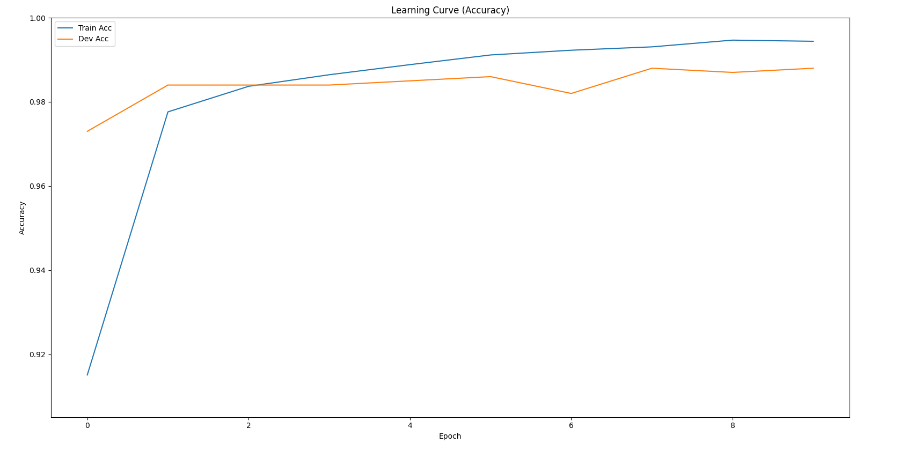
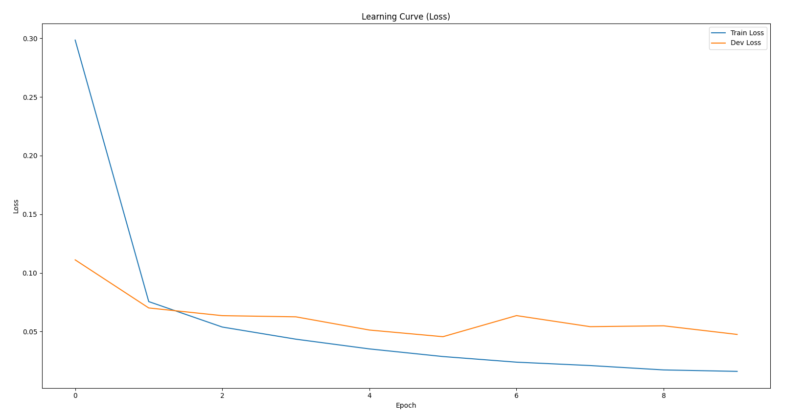
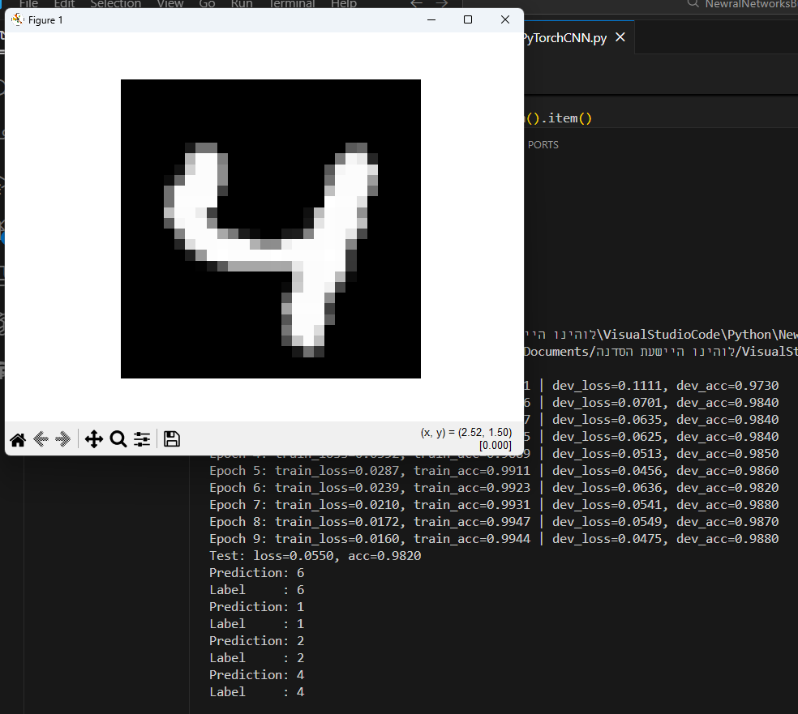

# MNIST CNN with PyTorch

This project implements a Convolutional Neural Network for MNIST digit classification using PyTorch.

---

## Architecture

Conv → ReLU → Conv → ReLU → MaxPool → Flatten → Fully Connected → Softmax

- 2 Convolutional layers
- MaxPooling
- Adam optimizer
- CrossEntropyLoss
- GPU support (if available)

---

## Dataset

- MNIST handwritten digit dataset (28x28 grayscale images)

---

## Features
- GPU acceleration (CUDA support)
  
- Mini-batch training
  
- Train & validation tracking
  
- Learning curve visualization
  
- Single image prediction testing

---

## Educational Goal
- This implementation demonstrates the transition from manual NumPy backpropagation to a framework-based deep learning pipeline.


---

## Results

### Learning Curve (Accuracy X Epoch)


### Learning Curve (Loss X Epoch)


### Learning Curve (Accuracy X Batch)


### Learning Curve (Loss X Batch)


### Example


---

## Performance

- Train Accuracy: XX.X%
- Validation Accuracy: XX.X%
- Test Accuracy: XX.X%

---

## How to Run

```bash
pip install torch torchvision numpy pandas matplotlib
python MNISTPyTorchCNN.py
