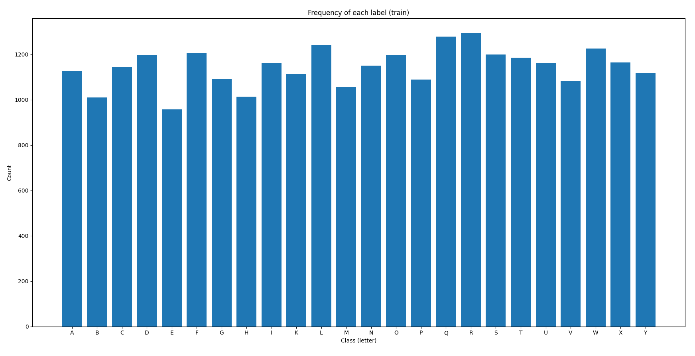
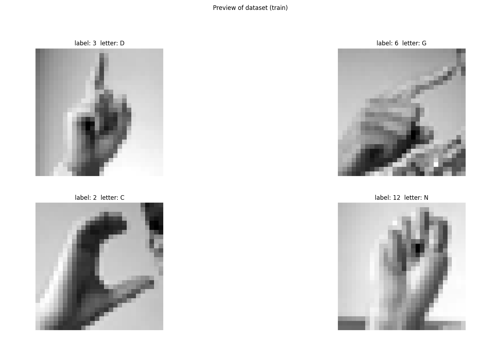
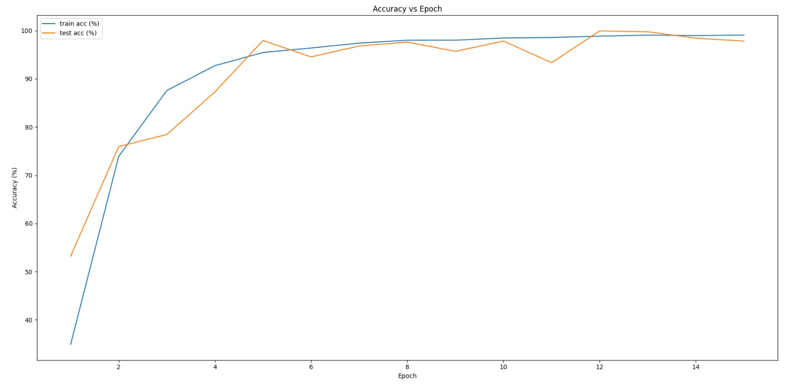
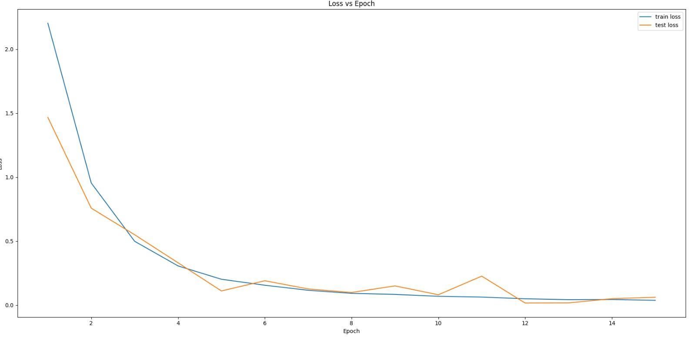
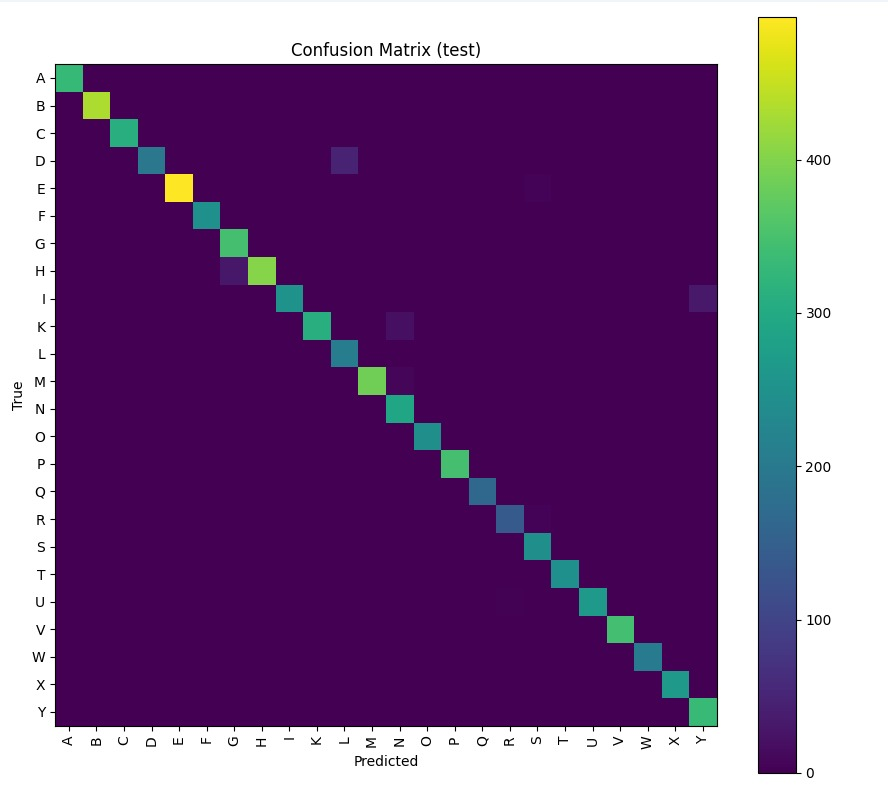
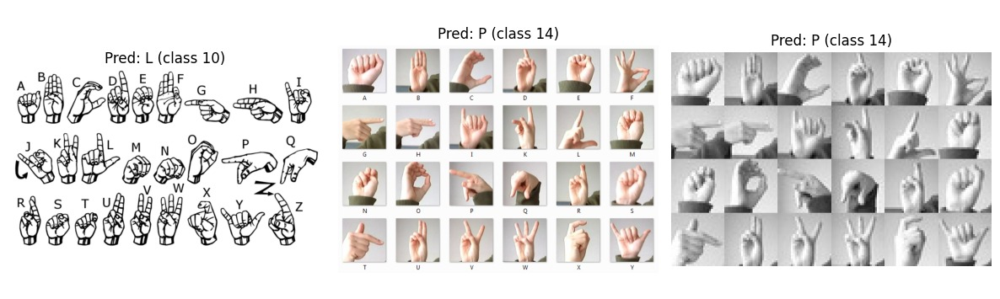

# Sign Language MNIST Classification (PyTorch CNN)

A high-performance Convolutional Neural Network for multi-class classification on the Sign Language MNIST dataset (24 hand gesture classes: A–Y excluding J and Z).

This project focuses on building a robust deep learning pipeline with strong generalization, stable convergence, and detailed evaluation tooling.

---

## Problem Overview

Classify 28x28 grayscale images of hand gestures representing sign language letters into 24 categories.

Key challenges:
- Visually similar hand configurations (e.g., M vs N, V vs W)
- Low-resolution inputs (28x28)
- Generalization across hand shapes and slight pose variations

---

## Dataset Analysis

- 28x28 grayscale images
- 24 classes
- Nearly balanced label distribution across all classes
- Controlled lighting and consistent framing

### Label Distribution (Train Set)


### Dataset Preview


The dataset shows strong class balance, which reduces bias and improves training stability.

---

## Model Architecture

The model follows a structured multi-block CNN design:

### Block 1
- Conv2D (1 → 32)
- BatchNorm
- ReLU
- Conv2D (32 → 32)
- BatchNorm
- ReLU
- MaxPool (28 → 14)

### Block 2
- Conv2D (32 → 64)
- BatchNorm
- ReLU
- Conv2D (64 → 64)
- BatchNorm
- ReLU
- MaxPool (14 → 7)

### Block 3
- Conv2D (64 → 128)
- BatchNorm
- ReLU
- MaxPool (7 → 4)

### Classification Head
- Global Average Pooling
- Dropout (0.3)
- Fully Connected Layer (128 → 24)

Loss Function:
- CrossEntropyLoss

Optimizer:
- AdamW with weight decay (L2 regularization)

---

## Training Behavior

### Accuracy vs Epoch


Observations:
- Rapid convergence within first 5 epochs
- Training accuracy stabilizes around ~99%
- Test accuracy closely tracks training accuracy
- No visible overfitting

---

### Loss vs Epoch


Observations:
- Smooth monotonic loss decrease
- Minimal oscillation
- Strong optimization stability
- Good generalization behavior

---

## Confusion Matrix (Test Set)



Analysis:
- Strong diagonal dominance
- Very few off-diagonal errors
- Most confusion occurs between visually similar gestures
- High class-wise precision and recall

---

## Example Predictions



The model correctly classifies varied hand shapes and maintains robustness across minor pose differences.

---

## Performance

- Final Test Accuracy: ~98–99%
- Fast convergence (≤ 5 epochs)
- Stable optimization
- No significant overfitting observed
- High class-wise consistency

---

## Techniques Applied

- Batch Normalization (stability)
- Dropout (regularization)
- Data Augmentation (RandomAffine, flipping)
- Weight decay (L2 regularization)
- Confusion matrix evaluation
- Full learning curve tracking

---

## What This Project Demonstrates

- Designing deeper CNN architectures
- Practical use of modern regularization techniques
- Multi-class classification at high accuracy
- Performance evaluation beyond simple accuracy
- Building production-grade PyTorch pipelines

---

## Future Improvements

- I can add cosine learning rate scheduler
- To introduce residual connections
- Export model to ONNX for optimized inference
- Compare this structure to other for optimization

---

## How to Run

```bash
pip install torch torchvision numpy pandas pillow matplotlib
python MNISTSignLanguagePyTorchCNN.py
